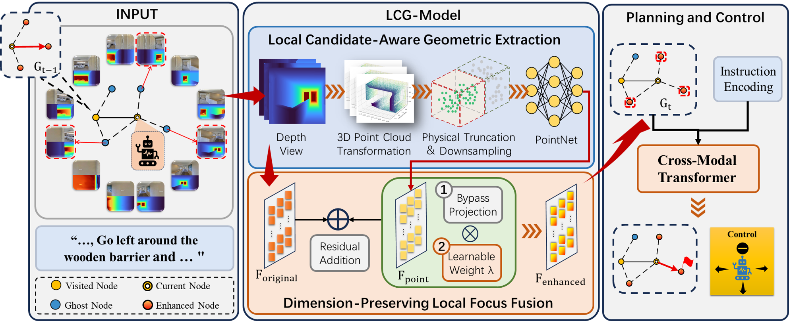
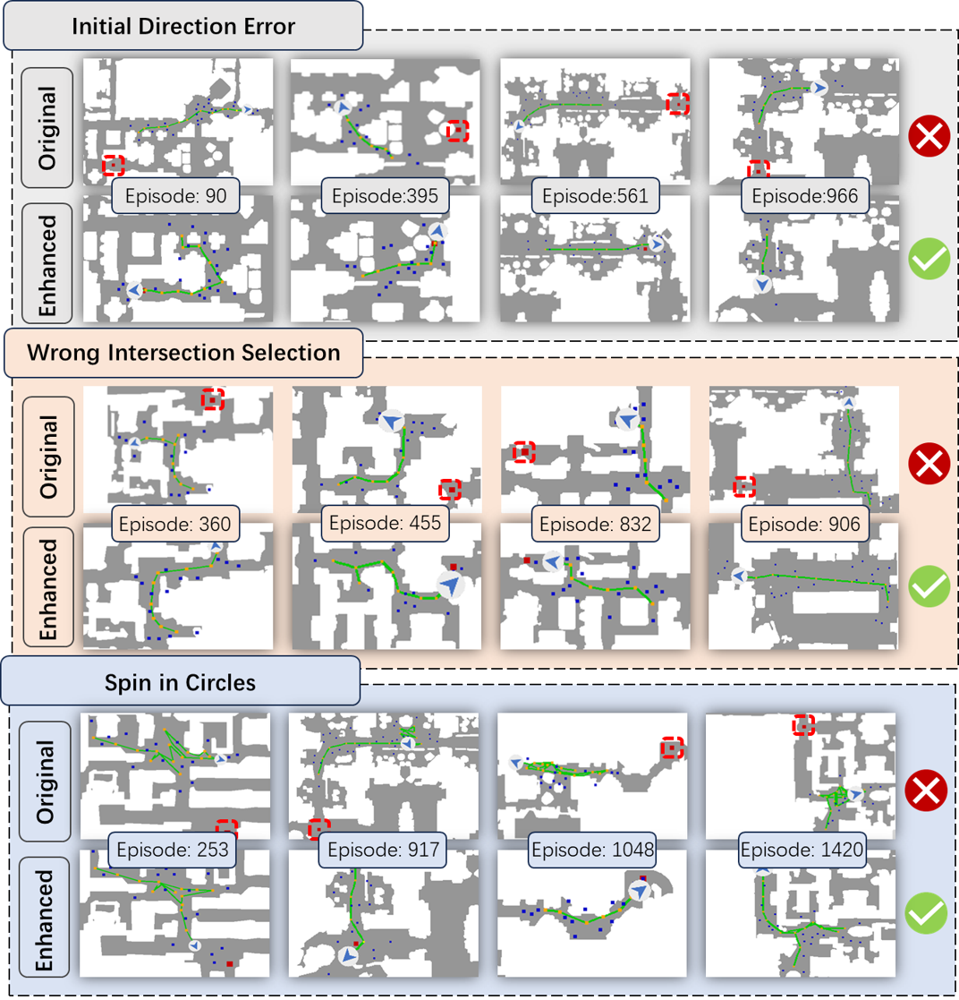

# LCGNav: Local Candidate-Aware Geometric Enhancement for General Topological Planning in Vision-Language Navigation



# Abstract

Online topological planning has become an effective paradigm for Vision-Language Navigation in Continuous Environments (VLN-CE), but existing methods still suffer from two limitations: redundant local depth information and weakened focus on current frontier candidates as the topological graph grows. To address this, we propose LCGNav, a modular local geometric enhancement framework for topological VLN. LCGNav explicitly converts candidate depth views into 3D point clouds and applies physical truncation based on the waypoint prediction range, enabling more compact local geometric modeling. It further introduces a dimension-preserving local fusion strategy with transient state degradation, so that geometric enhancement is applied only to the currently relevant ghost nodes without changing the original planner interface. Experiments on R2R-CE and RxR-CE show that LCGNav serves as an effective cross-architecture enhancement module, consistently improving path efficiency across representative online topological baselines with low additional training cost. When integrated with ETP-R1, LCGNav achieves state-of-the-art SPL on R2R-CE and improves all reported metrics on RxR-CE among the compared online topological methods.

### Installation

1. This project is developed with Python 3.7. If you are using [miniconda](https://docs.conda.io/en/latest/miniconda.html) or [anaconda](https://anaconda.org/), you can create an environment:

```bash
conda create -n vlnce python=3.7
conda activate vlnce
```

2. Install [habitat-sim](https://anaconda.org/aihabitat/habitat-sim/0.1.7/download/linux-64/habitat-sim-0.1.7-py3.7_headless_linux_856d4b08c1a2632626bf0d205bf46471a99502b7.tar.bz2) with the corresponding Python version and headless mode:

```bash
conda install habitat-sim-0.1.7-py3.7_headless_linux_856d4b08c1a2632626bf0d205bf46471a99502b7.tar.bz2
```

3. Then install [Habitat-Lab](https://github.com/facebookresearch/habitat-lab/tree/v0.1.7):

​	**Notice:** You need to comment out the TensorFlow line in `habitat_baselines/rl/requirements.txt`.

```bash
git clone --branch v0.1.7 git@github.com:facebookresearch/habitat-lab.git
cd habitat-lab
# installs both habitat and habitat_baselines
python -m pip install -r requirements.txt
python -m pip install -r habitat_baselines/rl/requirements.txt
python -m pip install -r habitat_baselines/rl/ddppo/requirements.txt
python setup.py develop --all
```

4. Clone this repository and install all requirements for `habitat-lab`, VLN-CE and our experiments. Note that we specify `gym==0.21.0` because its latest version is not compatible with `habitat-lab-v0.1.7`.

```bash
git clone git@github.com:shannanshouyin/LCGNav.git
cd LCGNav
pip install torch==1.9.1+cu111 torchvision==0.10.1+cu111 -f https://download.pytorch.org/whl/torch_stable.html
pip install git+https://github.com/openai/CLIP.git
pip install gym==0.21.0
python -m pip install -r requirements.txt
pip install torch-scatter==2.0.9 -f https://data.pyg.org/whl/torch-1.9.0+cu111.html # Only for BEVbert
```

### Scenes: Matterport3D

Instructions copied from [VLN-CE](https://github.com/jacobkrantz/VLN-CE):

Matterport3D (MP3D) scene reconstructions are used. The official Matterport3D download script (`download_mp.py`) can be accessed by following the instructions on their [project webpage](https://niessner.github.io/Matterport/). The scene data can then be downloaded:

```bash
# requires running with python 2.7
python download_mp.py --task habitat -o data/scene_datasets/mp3d/
```

Extract such that it has the form `scene_datasets/mp3d/{scene}/{scene}.glb`. There should be 90 scenes. Place the `scene_datasets` folder in `data/`.


## Running

1. The pre-training method and weights are inherited from  [ETPNav](https://github.com/MarSaKi/ETPNav),  [BEVBert](https://github.com/MarSaKi/VLN-BEVBert) and  [ETP-R1](https://github.com/Cepillar/ETP-R1). 

2. Post-training is performed based on the original fine-tuned weights from ETPNav, BEVBert and ETP-R1.

​	Use `main.bash` for `Training/Evaluation/Inference with a single GPU or with multiple GPUs on a single node.` Simply adjust the arguments of the bash scripts.

The running commands for ETPNav and BEVBert are as follows:

```
CUDA_VISIBLE_DEVICES=0 bash run_r2r/main.bash train 2333  # training
CUDA_VISIBLE_DEVICES=0 bash run_r2r/main.bash eval  2333  # evaluation

CUDA_VISIBLE_DEVICES=0 bash run_rxr/main.bash train 2333  # training
CUDA_VISIBLE_DEVICES=0 bash run_rxr/main.bash eval  2333  # evaluation
```

The running commands for ETP-R1 are as follows:

```
CUDA_VISIBLE_DEVICES=0 bash run_r2r/main.bash dagger 2333  # training
CUDA_VISIBLE_DEVICES=0 bash run_r2r/main.bash eval  2333  # evaluation

CUDA_VISIBLE_DEVICES=0 bash run_rxr/main.bash dagger 2333  # training
CUDA_VISIBLE_DEVICES=0 bash run_rxr/main.bash eval  2333  # evaluation
```

## Acknowledge

Our implementations are partially inspired by  [ETPNav](https://github.com/MarSaKi/ETPNav), [BEVBert](https://github.com/MarSaKi/VLN-BEVBert), [ETP-R1](https://github.com/Cepillar/ETP-R1).

Thanks for their great works!

## Performance Demonstration


